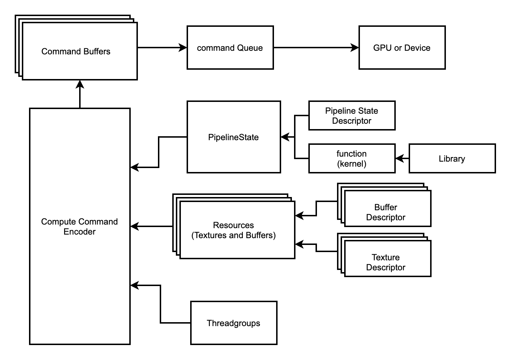

* content
{:toc}

# MTDrawer
设计一个底层基类，初始化renderPipelineState的基础配置
```swift
import MetalKit
class MTDrawer {
    let renderPipelineState: MTLRenderPipelineState

    init(
        device: MTLDevice,
        library: MTLLibrary,
        pixelFormat: MTLPixelFormat,
        vertexFunctionName: String,
        fragmentFunctionName: String
    ) throws {
        let vertexFunction = library.makeFunction(name: vertexFunctionName)
        let fragmentFunction = library.makeFunction(name: fragmentFunctionName)

        let renderPipelineDescriptor = MTLRenderPipelineDescriptor()
        renderPipelineDescriptor.vertexFunction = vertexFunction
        renderPipelineDescriptor.fragmentFunction = fragmentFunction
        renderPipelineDescriptor.colorAttachments[0].pixelFormat = pixelFormat
        renderPipelineDescriptor.colorAttachments[0].isBlendingEnabled = true
        renderPipelineDescriptor.colorAttachments[0].sourceRGBBlendFactor = .sourceAlpha
        renderPipelineDescriptor.colorAttachments[0].sourceAlphaBlendFactor = .one
        renderPipelineDescriptor.colorAttachments[0].destinationRGBBlendFactor = .oneMinusSourceAlpha
        renderPipelineDescriptor.colorAttachments[0].destinationAlphaBlendFactor = .one
        renderPipelineDescriptor.colorAttachments[0].rgbBlendOperation = .add
        renderPipelineDescriptor.colorAttachments[0].alphaBlendOperation = .max

        guard
            let renderPipelineState = try? device.makeRenderPipelineState(descriptor: renderPipelineDescriptor)
        else { throw MTKError(message: "No MTLRenderPipelineState") }
        self.renderPipelineState = renderPipelineState
    }
}
```
PipelineState Descriptor有两个很重要的参数vertexFunction,fragmentFunction。是顶点着色器和片元着色器的function name

# 子类实现 MTPointDrawer
初始化一个matrix矩阵用于存储buffer

向外暴露draw方法，方法需要传入render command encode参数，配置其pipeline state，buffer source，


# structure

    

