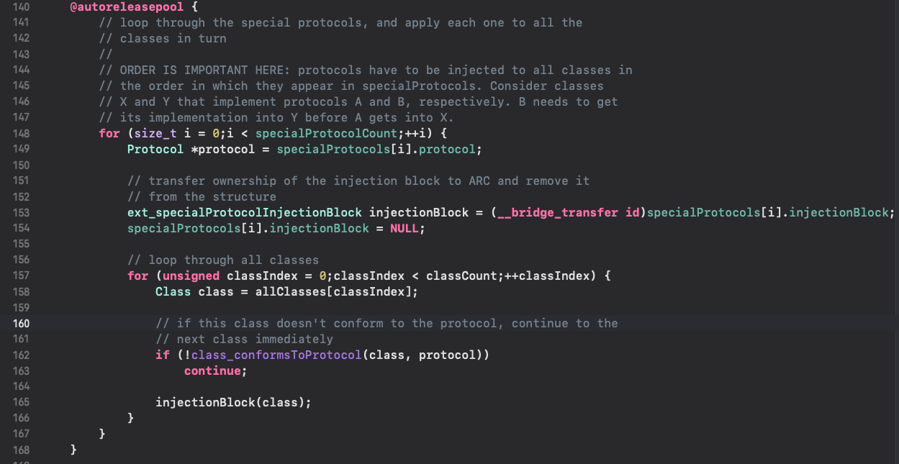

* content
{:toc}


# libextobjc源码

```objective-c
#define concreteprotocol(NAME) \
    /*
     * create a class used to contain all the methods used in this protocol
     */ \
    interface NAME ## _ProtocolMethodContainer : NSObject < NAME > {} \
    @end \
    \
    @implementation NAME ## _ProtocolMethodContainer \
    /*
     * when this class is loaded into the runtime, add the concrete protocol
     * into the list we have of them
     */ \
    + (void)load { \
        /*
         * passes the actual protocol as the first parameter, then this class as
         * the second
         */ \
        if (!ext_addConcreteProtocol(objc_getProtocol(metamacro_stringify(NAME)), self)) \
            fprintf(stderr, "ERROR: Could not load concrete protocol %s\n", metamacro_stringify(NAME)); \
    } \
    \
    /*
     * using the "constructor" function attribute, we can ensure that this
     * function is executed only AFTER all the Objective-C runtime setup (i.e.,
     * after all +load methods have been executed)
     */ \
    __attribute__((constructor)) \
    static void ext_ ## NAME ## _inject (void) { \
        /*
         * use this injection point to mark this concrete protocol as ready for
         * loading
         */ \
        ext_loadConcreteProtocol(objc_getProtocol(metamacro_stringify(NAME))); \
    }
```
通过代码可以看到concreteprotocol定义的宏有如下作用：

1.定义了自己的拼装类NAME ## _ProtocolMethodContainer

2.+load方法确保类对象遵守协议

3.main函数前执行初始构造函数ext_ ## NAME ## _inject：
    协议排序：协议样本array，协议a，协议b，如果协议a的子协议覆盖样本广于协议b，那么a的相对位置在b前（协议样本较少的原因，这部分不算耗时大头）
    协议注入前将协议样本排序，核心代码如下：
    从下面的代码看出，遍历了所有specialProtocol和class，耗时主要来源于此处
    
    
4.统计了下项目大概7万个oc class，遍历大概超过了200ms(iPhone13测试数据)

# 解决方案
方案一：参考网易云方案，比较简单粗暴。把协议实现直接拿到NSObject的category里，所有类都会拿到协议方法，是不是违背了设计初衷？？

方案二，参考KVO的做法，让MyClass的isa指针指向MyClass_ProtocolMethodContainer，协议方法由MyClass_ProtocolMethodContainer承担，但弊端同KVO一样，注射的协议不能继承。不太可行

方案三：耗时根症在于7万个class的遍历，能否缩小遍历的class范围？通过在继承特殊协议时注解体现？
```objective-c
@interface MyClass: NSObject <MyProtocol>
@end
 
@injectConcreprotocol(MyClass, MyProtocol)
 
 
#define injectConcreprotocol(className, protocolName) \
    interface CLASSNAME ## PROTOCOLNAME ## _ProtocolInjecter : NSObject {} \
    @end \
    \
    @implementation CLASSNAME ## PROTOCOLNAME ## _ProtocolInjecter \
    + (void)load { \
        /*
         * passes the actual protocol as the first parameter, then this class as
         * the second
         */ \
        ext_injectConcreteProtocol( \
            objc_getProtocol(metamacro_stringify(PROTOCOLNAME)), \
            objc_getClass(metamacro_stringify(PROTOCOLNAME ## _ProtocolInjecter)), \
            objc_getClass(metamacro_stringify(CLASSNAME)) \
        ); \
    } \
    @end \

```


