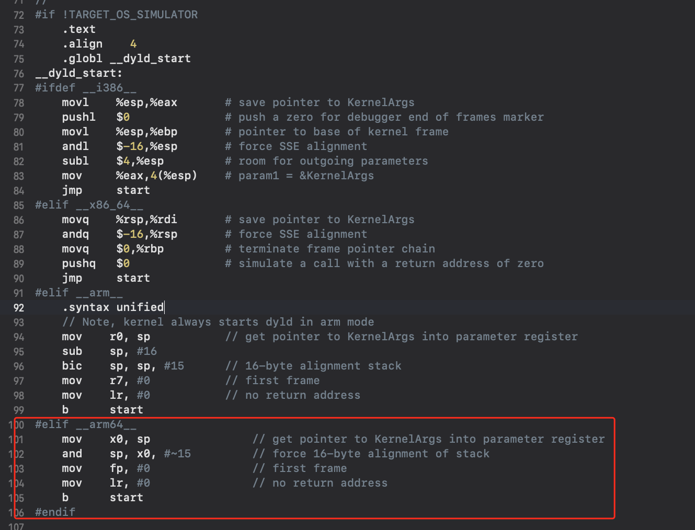

* content
{:toc}

# 背景

	app 缺少冷启动相关数据，后期做优化难以衡量指标。采纳了美团技术团队的方案:https://tech.meituan.com/2018/12/06/waimai-ios-optimizing-startup.html
	目前项目的冷启动被分割成三个时间段：
	T1: 进程启动到main执行
	T2: main开始执行到didFinish
	T3: didFinish到首页viewDidAppear
	
	试运一段时间后发现线上的数据不对劲，T1大半的数据长达200k-300k秒。怀疑是进程启动时间不靠谱，所以最近在寻找新的计时方案，在做新的计时方案前，写一篇博客把pre-main阶段搞透
	

	本文源码都来自苹果官网的open source，不存在自家代码泄露


\n\n\n\n

# pre-main
嫖一张美团的图


# 几个非常重要的时间域
- 动态库加载
- 静态库加载
- dyld
- +load
- __attribute__((construct))
- runtime
- ASLR


# dyld
	dyld（the dynamic link editor）是苹果的动态链接器，是苹果操作系统的重要组成部分，在app被编译打包成可执行文件格式的Mach-O文件后，交由dyld负责连接动静态库，加载程序。源码可以去官网的open source下载


	打开time profile，可以观察到dyld的耗时情况，dyld4是WWDC2022提出的版本https://www.jianshu.com/p/3bff650d90ed

	我们随便找个+load打断点就能看到它的执行路径

	prepare →  runAllInitializersForMain → Loader → runtime → load_image

	注意：这里dyld4的启动是dyld4:: prepare，因为我的设备是14+iOS16.5。好像记得iOS13一下或者iPhone12以下是dyld3？。dyld4之前的启动是从__dyld_start函数开始的，网上大多数博客也是从__dyld_start开始分析的。从那个函数开始无关紧要，搞清楚dyld的流程就行

	小结：dyld囊括了整个pre-main除了进程启动的阶段，你可以把dyld执行域当作整个pre-main最广的存在，当然也是最耗时的

	dyld的第一个函数：

	void start(const KernelArgs* kernArgs, void* prevDyldMH) __attribute__((noreturn)) __asm("start");

	这个c函数后面带了两个属性：__attribute__((noreturn))，表示汇编代码中br进来后，不会再跳出，更不会去恢复上次函数现场

	__asm("start");表示这个c函数的汇编符号叫做start（在汇编代码中，函数是没有参数的，函数并不知道需要多少参数！需要哪些参数！）
	
	下图就是__dyld_start汇编函数的定义：以arm64架构为例，

	简述下汇编代码含义：

	x0 = sp

	sp = x0 &  0xFFFF FFFF FFFF FFF0

	fp = 0x0

	lr = 0x0 (不用再回到这个调用环境)

	执行start函数


	看来函数执行前，kernArgs和prevDyldMH这两个参数已经进了堆栈sp了


	这张图，就是进入__dyld_start函数时的sp堆栈状态，看得出，sp栈顶指向的正是mach-o的header


	接下来就分析下dyld干了啥


	下图是dyld4的流程。just-in-time是dyld4新增的一种缓存策略，在dyld3中是没有的。


# chanStarts动态链式修复，后面要做rebase/bind，这里是一步优化操作，不算重点
```objectivec
    const MachOAnalyzer* dyldMA = getDyldMH();
    uintptr_t            slide  = dyldMA->getSlide();
    if ( !dyldMA->inDyldCache() ) {
        assert(dyldMA->hasChainedFixups());
        __block Diagnostics diag;
        dyldMA->withChainStarts(diag, 0, ^(const dyld_chained_starts_in_image* starts) {
            dyldMA->fixupAllChainedFixups(diag, starts, slide, dyld3::Array<const void*>(), nullptr);
        });
        diag.assertNoError();

        // make __DATA_CONST read-only (kernel maps it r/w)
        dyldMA->forEachSegment(^(const MachOAnalyzer::SegmentInfo& segInfo, bool& stop) {
            if ( segInfo.readOnlyData ) {
                const uint8_t* start = (uint8_t*)(segInfo.vmAddr + slide);
                size_t         size  = (size_t)segInfo.vmSize;
                sSyscallDelegate.mprotect((void*)start, size, PROT_READ);
            }
        });
    }
```
# 添加动态库映像
```objectivec
    // Add dyld to compact info
    if ( dyldMA->inDyldCache() && processSnapshot->sharedCache() ) {
        processSnapshot->addSharedCacheImage((const struct mach_header *)dyldMA);
    } else {
        FileRecord dyldFile;
        if (state.config.process.dyldFSID && state.config.process.dyldObjID) {
            dyldFile = state.fileManager.fileRecordForVolumeDevIDAndObjID(state.config.process.dyldFSID, state.config.process.dyldObjID);
            if ( dyldFile.volume().empty() )
                dyldFile = state.fileManager.fileRecordForPath(state.config.process.dyldPath);
        } else {
            dyldFile = state.fileManager.fileRecordForPath(state.config.process.dyldPath);
        }
        auto dyldImage = Image(state.ephemeralAllocator, std::move(dyldFile), processSnapshot->identityMapper(), (const mach_header*)getDyldMH());
        processSnapshot->addImage(std::move(dyldImage));
    }
```
# 拿到man.m的执行地址，后面prepare好了就执行main
```objectivec
    // Add the main executable to compact info
    FileRecord mainExecutableFile;
    if (state.config.process.mainExecutableFSID && state.config.process.mainExecutableObjID) {
        mainExecutableFile = state.fileManager.fileRecordForVolumeDevIDAndObjID(state.config.process.mainExecutableFSID, state.config.process.mainExecutableObjID);
        if ( mainExecutableFile.volume().empty() )
            mainExecutableFile = state.fileManager.fileRecordForPath(state.config.process.mainExecutablePath);
    } else {
        mainExecutableFile = state.fileManager.fileRecordForPath(state.config.process.mainExecutablePath);
    }
    auto mainExecutableImage = Image(state.ephemeralAllocator, std::move(mainExecutableFile), processSnapshot->identityMapper(), (const mach_header*)state.config.process.mainExecutable);
    processSnapshot->addImage(std::move(mainExecutableImage));
    processSnapshot->setInitialImageCount(state.initialImageCount());
    state.commitProcessSnapshot();
```

# __attribute__((noinline)) static MainFunc prepare(APIs& state, const MachOAnalyzer* dyldMH)，注意参数state里面有个重要的变量叫RuntimeLocks，后面说明它的作用

	prepare函数是dyld的主体函数，来看下做了什么

# 异常堆栈日志的环境设置

```objectivec
    gProcessInfo->terminationFlags = 0; // by default show backtrace in crash logs
    gProcessInfo->platform         = (uint32_t)state.config.process.platform;
    gProcessInfo->dyldPath         = state.config.process.dyldPath;

    uint64_t launchTraceID = 0;
    if ( dyld3::kdebug_trace_dyld_enabled(DBG_DYLD_TIMING_LAUNCH_EXECUTABLE) ) {
        launchTraceID = dyld3::kdebug_trace_dyld_duration_start(DBG_DYLD_TIMING_LAUNCH_EXECUTABLE, (uint64_t)state.config.process.mainExecutable, 0, 0);
    }

```

# dyld加载到uuidArray中，启动符号堆叠。让你能在backtrace里看到dyld
```objectivec
    if ( !dyldMH->inDyldCache() ) {
        dyld_uuid_info dyldInfo;
        dyldInfo.imageLoadAddress = dyldMH;
        dyldMH->getUuid(dyldInfo.imageUUID);
        addNonSharedCacheImageUUID(state.persistentAllocator, dyldInfo);
    }
```

# 递归加载动态库
```objectivec
    // load any inserted dylibs
    STACK_ALLOC_OVERFLOW_SAFE_ARRAY(Loader*, topLevelLoaders, 16);
    topLevelLoaders.push_back(mainLoader);
    Loader::LoadChain   loadChainMain { nullptr, mainLoader };
    Loader::LoadOptions options;
    options.staticLinkage   = true;
    options.launching       = true;
    options.insertedDylib   = true;
    options.canBeDylib      = true;
    options.rpathStack      = &loadChainMain;
    state.config.pathOverrides.forEachInsertedDylib(^(const char* dylibPath, bool& stop) {
        Diagnostics insertDiag;
        if ( Loader* insertedDylib = (Loader*)Loader::getLoader(insertDiag, state, dylibPath, options) ) {
            topLevelLoaders.push_back(insertedDylib);
            state.notifyDebuggerLoad(insertedDylib);
            if ( insertedDylib->isPrebuilt )
                state.loaded.push_back(insertedDylib);
        }
        else if ( insertDiag.hasError() && !state.config.security.allowInsertFailures  ) {
            state.log("terminating because inserted dylib '%s' could not be loaded: %s\n", dylibPath, insertDiag.errorMessageCStr());
            halt(insertDiag.errorMessage());
        }
    });

    // recursively load everything needed by main executable and inserted dylibs
    Diagnostics depsDiag;
    options.insertedDylib = false;
    if ( needToWritePrebuiltLoaderSet )
        options.pathNotFoundHandler = missingLogger;
    for ( Loader* ldr : topLevelLoaders ) {
        ldr->loadDependents(depsDiag, state, options);
        if ( depsDiag.hasError() ) {
            //state.log("%s loading dependents of %s\n", depsDiag.errorMessage(), ldr->path());
            // let debugger/crashreporter know about dylibs we were able to load
            uintptr_t topCount = topLevelLoaders.count();
            STACK_ALLOC_VECTOR(const Loader*, newLoaders, state.loaded.size() - topCount);
            for (size_t i = topCount; i != state.loaded.size(); ++i)
                newLoaders.push_back(state.loaded[i]);
            state.notifyDebuggerLoad(newLoaders);
            gProcessInfo->terminationFlags = 1; // don't show back trace, because nothing interesting
            halt(depsDiag.errorMessage());
        }
    }
```

# runAllInitializersForMain

分为三步

- libSystemLoader（先C++ initial，再+load）

- state.loader（先+load，再C++ initial），注意下面这里的这个for是一个优化步骤，这是再检索缓存内容，避免前置依赖的嵌套导致堆栈吃紧
- runInitializersBottomUpPlusUpwardLinks核心内容还是在这里，这是个递归解依赖的步骤

```objectivec
void APIs::runAllInitializersForMain()
{
    // disable page-in linking, not used for dlopen() loaded images
    if ( !config.security.internalInstall || (config.process.pageInLinkingMode != 3) )
        config.syscall.disablePageInLinking();

    // run libSystem's initializer first
    const_cast<Loader*>(this->libSystemLoader)->beginInitializers(*this);
    this->libSystemLoader->runInitializers(*this);
    gProcessInfo->libSystemInitialized = true;

    // after running libSystem's initializer, tell objc to run any +load methods on libSystem sub-dylibs
    this->notifyObjCInit(this->libSystemLoader);
    // <rdar://problem/32209809> call 'init' function on all images already init'ed (below libSystem)
    // Iterate using indices so that the array doesn't grow underneath us if a +load dloopen's
    for ( uint32_t i = 0; i != this->loaded.size(); ++i ) {
        const Loader* ldr = this->loaded[i];
        if ( (ldr->dylibInDyldCache || ldr->analyzer(*this)->isDylib()) && (strncmp(ldr->analyzer(*this)->installName(), "/usr/lib/system/lib", 19) == 0) ) {
            // check install name instead of path, to handle DYLD_LIBRARY_PATH overrides of libsystem sub-dylibs
            const_cast<Loader*>(ldr)->beginInitializers(*this);
            this->notifyObjCInit(ldr);
            const_cast<Loader*>(ldr)->runInitializers(*this);
        }
    }

#if TARGET_OS_OSX
    // If we're PID 1, scan for roots
    if ( (this->config.process.pid == 1) && (this->libSystemHelpers->version() >= 5) ) {
        this->libSystemHelpers->run_async(&ProcessConfig::scanForRoots, (void*)&this->config);
    }
#endif // TARGET_OS_OSX

    // run all other initializers bottom-up, running inserted dylib initializers first
    // Iterate using indices so that the array doesn't grow underneath us if an initializer dloopen's
    for ( uint32_t i = 0; i != this->loaded.size(); ++i ) {
        const Loader* ldr = this->loaded[i];
        ldr->runInitializersBottomUpPlusUpwardLinks(*this);
        // stop as soon as we did main executable
        // normally this is first image, but if there are inserted N dylibs, it is Nth in the list
        if ( ldr->analyzer(*this)->isMainExecutable() )
            break;
    }
}
```

# findAndRunAllInitializers

也分两步：

- 执行全局静态构造函数__attribute__((constructor))
- 执行静态终止器，几乎用不到，不用关心
```
    ma->forEachInitializer(diag, vmAddrConverter, ^(uint32_t offset) {
        Initializer func = (Initializer)((uint8_t*)ma + offset);
        if ( state.config.log.initializers )
            state.log("running initializer %p in %s\n", func, this->path());
#if __has_feature(ptrauth_calls)
        func = __builtin_ptrauth_sign_unauthenticated(func, ptrauth_key_asia, 0);
#endif
        dyld3::ScopedTimer timer(DBG_DYLD_TIMING_STATIC_INITIALIZER, (uint64_t)ma, (uint64_t)func, 0);
        func(state.config.process.argc, state.config.process.argv, state.config.process.envp, state.config.process.apple, state.vars);
    });
```

# runInitializersBottomUpPlusUpwardLinks，递归解依赖（重点）
	如果没有前置依赖，看下面。看清楚是先+load再做C++的初始化
```objectivec
void Loader::runInitializersBottomUp(RuntimeState& state, Array<const Loader*>& danglingUpwards) const
{
    // do nothing if already initializers already run
    if ( (const_cast<Loader*>(this))->beginInitializers(state) )
        return;

    //state.log("runInitializersBottomUp(%s)\n", this->path());

    // make sure everything below this image is initialized before running my initializers
    const uint32_t depCount = this->dependentCount();
    for ( uint32_t i = 0; i < depCount; ++i ) {
        DependentKind childKind;
        if ( Loader* child = this->dependent(state, i, &childKind) ) {
            if ( childKind == DependentKind::upward ) {
                // add upwards to list to process later
                if ( !danglingUpwards.contains(child) )
                    danglingUpwards.push_back(child);
            }
            else {
                child->runInitializersBottomUp(state, danglingUpwards);
            }
        }
    }

    // tell objc to run any +load methods in this image (done before C++ initializers)
    state.notifyObjCInit(this);

    // run initializers for this image
    this->runInitializers(state);
}

```

# 如果没有前置依赖，如上图标注代码中，notifyObjCInit，来看下做了什么
	我找到最终和这个函数有关，notiofyObjCInit最终会执行一个回调，这个回调是下面这个函数参数init

	然而我在dyld的源码中找不到在什么地方调用了这个函数。最后发现函数的调用位置在libobjc里面。
	
```
void APIs::_dyld_objc_register_callbacks(const _dyld_objc_callbacks* callbacks)
```

# runtime，我们从官网继续下载libobjc源码

	官网的open source好像找不到libobjc了，贴一个下载地址：https://github.com/apple-oss-distributions/objc4/tags

	看来init就是这个load_images函数，最终定位到runtime下面去了，load_images看下先搞category，然后+load

	关于runtime的细致步骤，category如何加载、isa指针、instance method、class method等不再展开讨论。后续如有需要可以出一个文档。
```
void _objc_init(void)
{
    static bool initialized = false;
    if (initialized) return;
    initialized = true;
    
    // fixme defer initialization until an objc-using image is found?
    environ_init();
    static_init();
    runtime_init();
    exception_init();
    cache_t::init();

    _imp_implementationWithBlock_init();

    _dyld_objc_callbacks_v1 callbacks = {
        1, // version
        &map_images,
        load_images,
        unmap_image,
        _objc_patch_root_of_class
    };
    _dyld_objc_register_callbacks((_dyld_objc_callbacks*)&callbacks);

    didCallDyldNotifyRegister = true;
}
```
	找一下load_images这个函数指针
```
void
load_images(const char *path __unused, const struct mach_header *mh)
{
    if (!didInitialAttachCategories && didCallDyldNotifyRegister) {
        didInitialAttachCategories = true;
        loadAllCategories();
    }

    // Return without taking locks if there are no +load methods here.
    if (!hasLoadMethods((const headerType *)mh)) return;

    recursive_mutex_locker_t lock(loadMethodLock);

    // Discover load methods
    {
        mutex_locker_t lock2(runtimeLock);
        prepare_load_methods((const headerType *)mh);
    }

    // Call +load methods (without runtimeLock - re-entrant)
    call_load_methods();
}
```

#小结
	在整个dyld的生命周期里，充斥了一个最核心的类，叫Loader，它有两个派生，一个叫PrebuiltLoader，一个叫JustInTimeLoader。

	PrebuiltLoader是dyld3引入的东西，它提供一种启动优化，名叫启动闭包。大致意思是，解析后的启动数据保存到本地，以供下次app避免重复解析。（当然这些数据不可能是常驻内存的）

	JustInTimeLoader是dyld4引入的。这个东西资料太少了，毕竟是22年引入的，官网上也没查到，暂时不太清楚是怎么优化的

#结论
	下图把dyld中runtime的加载过程大致绘出了，整个流程也是pre-main的执行流程


